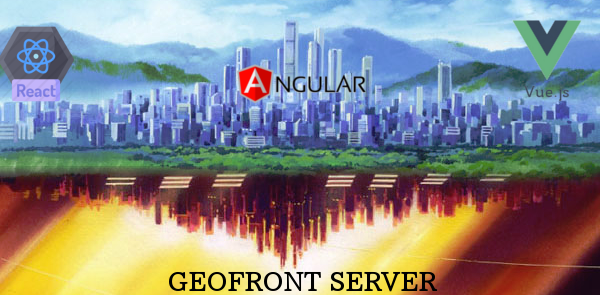

# GeoFrontend - The server for your frontends



Minimal nodejs express server to publish html static SPA webpage which is the result of **npm run build** command on your projects :react, angulas, vue ,etc and inject security and settings to your bundle

# Functionalities

- Static server for your builded assests from any framework like vue, angular, react. etc
- Forget about security when your are developing in any javascript framework, because the **geofrontend server** will manage it.
- By default, **basic authentication** is ready to use.
- How to keep one javascript build across several environments? Let me think.. Yeah **geofrontend server** will publish and **/settings.json** http endpoint with custom configuration for your web.

# Modes

In order to publish your static assets, you could choose one of these modes:

**GeoFrontend server as npm module**

**GeoFrontend server as standalone**

> The following steps are tested in Linux environments. For windows check this [guide](https://github.com/utec/geofrontend-server/wiki/Windows-Guideline)


# Geofrontend server as npm module

Just add the dependency:

```
npm install utec/geofrontend-server#master --save
```

Add an entry in your scripts:

```json
"scripts": {
  "start": "geofrontend-server -config=./application.json -bundle=./build"
}
```

Create a file called **application.json** inside of your application, based on **application.json.template**

Export these values:

```bash
export AUTH_USER=jane
export AUTH_PASSWORD=doe
export PORT=8080
export LOG_PATH=/tmp/app.log
export LOG_LEVEL=info
```

Build your app with **npm run build**

And just run with: **npm run start**

Go to your browser an enter to http://localhost:8080 and a popup will prompt you asking the credentials.

> It is assumed that your application has an command called **build** and the result of that is stored in **public** folder. Just change it according to your real scenario

# Geofrontend server as standalone

- Clone this repository
- Execute **npm run build** or any command required to **build** your application.
- Move all your static files (html, css, js, img) into build folder. **index.html** file must exist. You could use the index.html in **sample** folder.
- Rename the default **application.json.template** to **application.json**
- Install node libraries :

```
npm install
```

Export these values:

```
export AUTH_USER=jane
export AUTH_PASSWORD=doe
export PORT=8080
export LOG_PATH=/tmp/app.log
export LOG_LEVEL=info
```

And just run with: **npm run start**

Go to your browser an enter to http://localhost:8080 and a popup will prompt you asking the credentials.

# Advanced topics

- [What is application.json](https://github.com/utec/geofrontend-server/wiki/What-is-application.json)
- [What is settings.json](https://github.com/utec/geofrontend-server/wiki/What-is-settings.json)
- [Mock settings.json with Webpack](https://github.com/utec/geofrontend-server/wiki/Mock-settings-with-Webpack)
- [How create custom security](https://github.com/utec/geofrontend-server/wiki/How-create-custom-security)
- [Enable welcome page](https://github.com/utec/geofrontend-server/wiki/Enable-welcome-page)

# Roadmap

- [ ] Use an advanced session store (i.e redis, mongo.) instead express default memory.
- [ ] Search an easy way for development stage: Frameworks in development mode, uses internal light server like express and **geofrontend server** works only for your builded assets.

# Contributors

<table>
  <tbody>
    <td>
      
      <br />
      <label><a href="http://jrichardsz.github.io/">Richard Leon</a></label>
      <br />
    </td>
    <td>
      
      <br />
      <label><a href="https://github.com/nbpalomino/">Nick Palomino</a></label>
      <br />
    </td>
  </tbody>
</table>

# License

[MIT License](./LICENSE)
